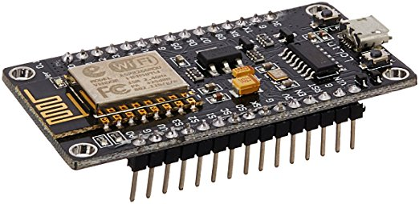
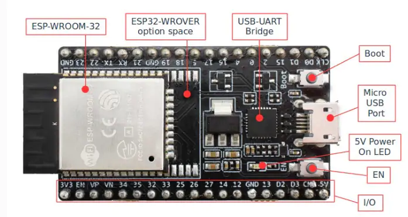

# microAkka : Akka  framework in C++  on microcontrollers

C++ Actor Framework for Embedded Systems - [Akka](https://akka.io/) alike



## Target

The purpose is to provide a  C++ framework for writing message driven actors. 

Seen the popularity of the Lightbend Akka framework and its extensive documentation and features, I decided to build this 
framework on the same principles and naming conventions. Saves me some time on documenting my own stuff. ;-) 

The article :
https://medium.com/@unmeshvjoshi/how-akka-actors-work-b0301ec269d6
was very helpful to understand the inner working of Akka framework.

My intention is that a central brain running on PC or server can interact with IOT devices, the communication between both should be transparently
as communicating local between actors. The actor systems can bridge communication between devices  using MQTT.

The MQTT topic and message are based on some conventions to ease integration.
#### Topics&Messages for request-reply pattern
- each actor has several  paths or addresses on MQTT :  for listening for messages destined to this device-actor : ***dst/ActorSystem/Actor/MessageClass***
- The MessageClass is extended with "Reply" to specify the message type reply
- message is a JSON object with a reply address in "$src" field and "$id" for each request to be used in the reply. The rest of the field names can be freely chosen specific for the Request/Reply handled. 
#### Topics&Messages for event pattern
- some for emitting events and properties : ***src/ActorSystem/Actor/Property***
- The values are most of the time simple singular JSON values

#### Examples
- Event system upTime : src/ESP32-7847/system/upTime : 4643244
- Request get Actor 'system' properties : dst/ESP32-63147/system/properties : {"src":"master/brain","id":1234 }
- Reply to Actor master/brain : dst/master/brain/propertiesReply :{"id":122,"ssid":"MySsid","ip":"192.168.0.157","mac":"AE:38:FB:3F:0A:00","src":"ESP32-63147/wifi"}


## Design decisions
- The interface is close to the Java API of Akka as C++ translation was easier compared to the Scala interface.  
- To reduce resource consumptions in a limited embedded environment some design aspects are different from Akka Java/Scala. 
- actors can share the same mailbox, each mailbox has 1 thread ( MessageDispatcher ) to invoke the actors. On FreeRtos based controllers multiple threads ( aka Tasks ) can be started running dispatchers with multiple mailboxes. On Arduino common platform this will be likely limited to 1 thread. This is close to a coroutine model. 
- C++ has limited introspection facilities, so message classes are put explicitly into the message
- the message passed between actors is in a **in-memory serialized form**, based on aspects from **Xdr** ( 4 byte granularity ) and **Protobuf** ( each element is tagged ). The message is copied and a pointer to this copy is passed on. Since most controllers are already 32 bit word aligned, the Xdr form should speed up data retrieval.
- little attention has been given on **stopping actors** as in an embedded environment these actors are started once and run forever, so no resource cleanup yet there.
- Unique id's are created based on FNV hashing, when compiler optimization is activated this is executed at compile time and not run-time. These **unique id's** are used for string references in 16 bit and actor references. These 16 bit hashes speed up comparison and extraction
- A number of building blocks supporting an Akka framework are provided by an RTOS like **FreeRTOS**. So as I first started without an RTOS the result was simulating a lot of an RTOS was offering out of the box. So seen the support of Amazon for FreeRTOS and the general availability for different processors it was an easy arbitration to go for this approach. See also : https://community.arm.com/iot/embedded/b/embedded-blog/posts/beyond-the-rtos-a-better-way-to-design-real-time-embedded-software . It was even possible to keep the approach of fine tuning the code first on a linux platform and deploy then on a microcontroller as there exists FreeRTOS simulators on Linux. 

## Platforms supported
- Linux ( Debian ), should work on all linux versions - repository microAkka
- ESP32 with ESP-IDF - repository [akkaEsp32](https://github.com/vortex314/akkaEsp32)
- ESP8266 with ESP-OPEN-RTOS - repository [akkaEsp8266](https://github.com/vortex314/akkaEsp8266)
- Arduino : see [akkaArduino](https://github.com/vortex314/akkaArduino)  (  ESP8266 )

### History
#### v0.3 Multi thread
- added multi-thread to dispatcher on same mailbox. Creates a semaphore for controlling access to actorcell and actor. 
- Per thread copy of receiving and sending message. Enables building messages in actor based on common Msg object 
#### v0.2 FreeRTOS
aligned all code on Linux, ESP8266 and ESP32 to use FreeRTOS API : timers, queues,semaphores. Shoudl enable other microcontrollers where the RTOS has been ported.
MQTT and System actor is a per platform implementation

### Prerequisites
- C++ 11 compiler
- MQTT library dependent on platform
- Common repository with platform specifics

### Actors 
#### Publisher : gets and publishes properties from actors
- sends a 'properties' message and gets a 'propertiesReply' back

#### Sender : executing performance test to Echo to check nbr of messages/sec 
- sends during 1 sec ping & receives pong as fast as possible
#### System : collect system characteristics 
- publishes system features
#### Bridge : send and receive non-local messages 
- routes non-local messages to MQTT , messages from MQTT are transferred to local binary messages
- MQTT messages are JSON based
An actor that replies with an increment of a counter

C++ code
```
__________________________________________________ main

int main() {

Sys::init();
Mailbox defaultMailbox("default", 100); // nbr of messages in queue max
MessageDispatcher defaultDispatcher;
ActorSystem actorSystem(Sys::hostname(), defaultDispatcher, defaultMailbox);

ActorRef sender = actorSystem.actorOf<Sender>("sender"); // will also start echo actor
ActorRef system = actorSystem.actorOf<System>("System");
ActorRef nnPid = actorSystem.actorOf<NeuralPid>("neuralPid");
ActorRef mqtt = actorSystem.actorOf<Mqtt>("mqtt", "tcp://limero.ddns.net:1883");
ActorRef bridge = actorSystem.actorOf<Bridge>("bridge",mqtt);

defaultDispatcher.attach(defaultMailbox);
defaultDispatcher.unhandled(bridge.cell());
defaultDispatcher.execute();
__________________________________________________ Echo.cpp

Echo::Echo(va_list args)  {}
Echo::~Echo() {}

Receive& Echo::createReceive() {
	return receiveBuilder()
	       .match(PING,
	[this](Msg& msg) {
		uint32_t counter;
		assert(msg.get("counter", counter)==0);
		sender().tell(msgBuilder(PONG)("counter",counter+1),self());
	})
	.build();
}
```

Java / Scala code
```
Coming
```


### Installing

- Download git repo https://github.com/vortex314/microAkka
- Download git repo https://github.com/vortex314/Common
- Download git repo https://github.com/bblanchon/ArduinoJson
	- set env variables and mqtt URL

	```
	Give the example
	```


	End with an example of getting some data out of the system or using it for a little demo

## Running the tests

Explain how to run the automated tests for this system

### Break down into end to end tests

Explain what these tests test and why

```
Give an example
```

### And coding style tests

Explain what these tests test and why

```
Give an example
```

## Deployment

Add additional notes about how to deploy this on a live system

## Built With

* [Codelite](http://www.dropwizard.io/1.0.2/docs/) - The  C++ IDE  used
* [Akka doc](https://doc.akka.io/docs/akka/2.5/general/actor-systems.html) - Documentation
* [How Akka Actors work ](https://medium.com/@unmeshvjoshi/how-akka-actors-work-b0301ec269d6) - Used to generate RSS Feeds


## Versioning

We use [SemVer](http://semver.org/) for versioning. For the versions available, see the [tags on this repository](https://github.com/vortex314/microAkka/tags).

## Authors

* **Lieven Merckx** - *Initial work* -

## License

This project is licensed under the MIT License - see the [LICENSE.md](LICENSE.md) file for details
